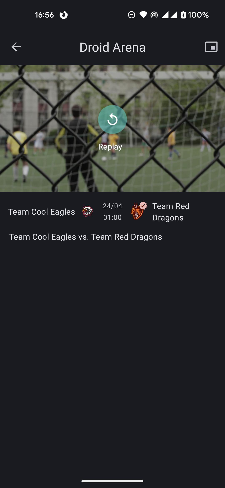
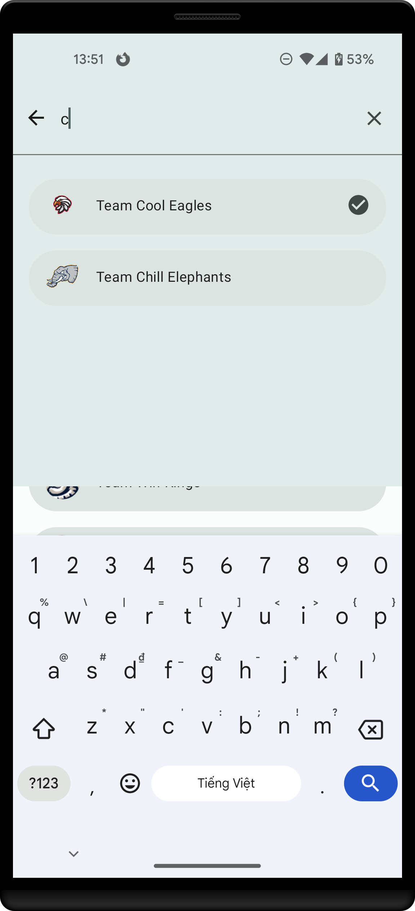
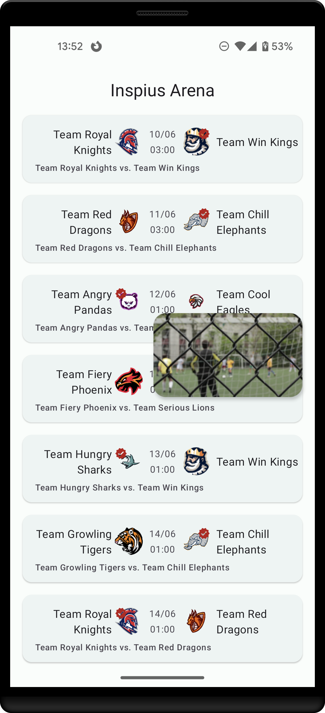
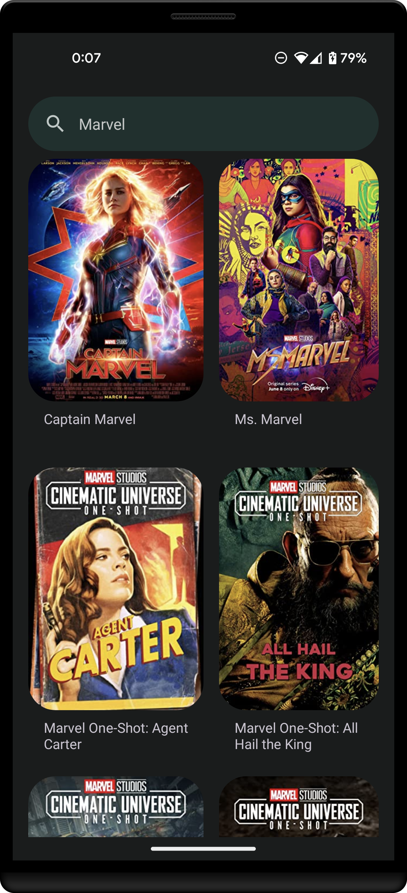
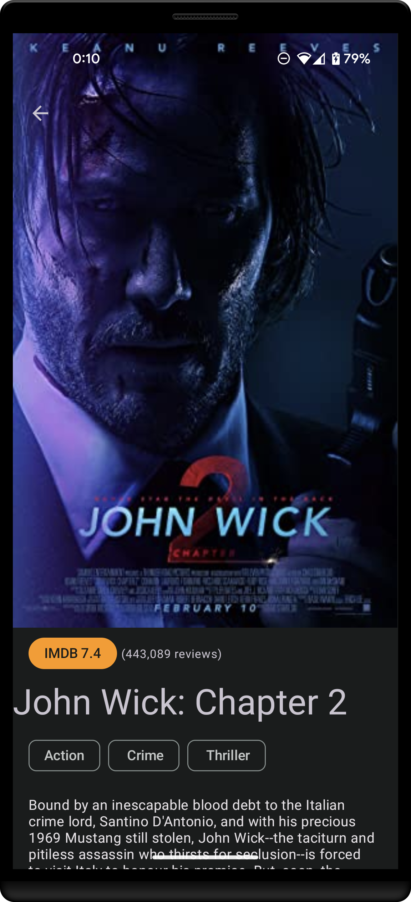
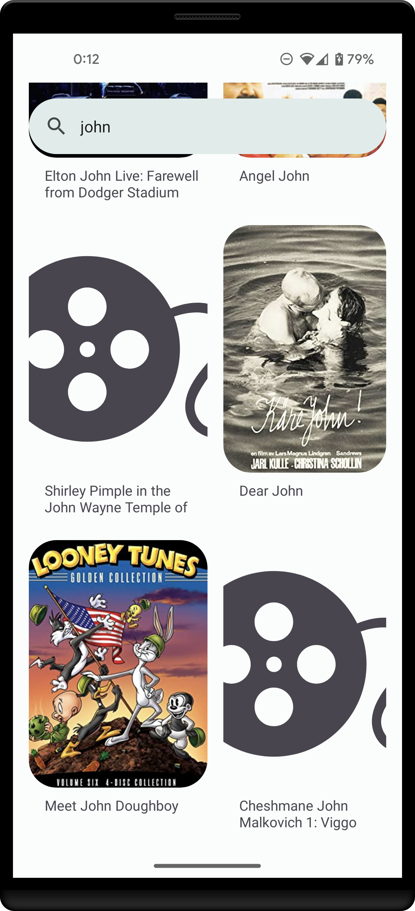
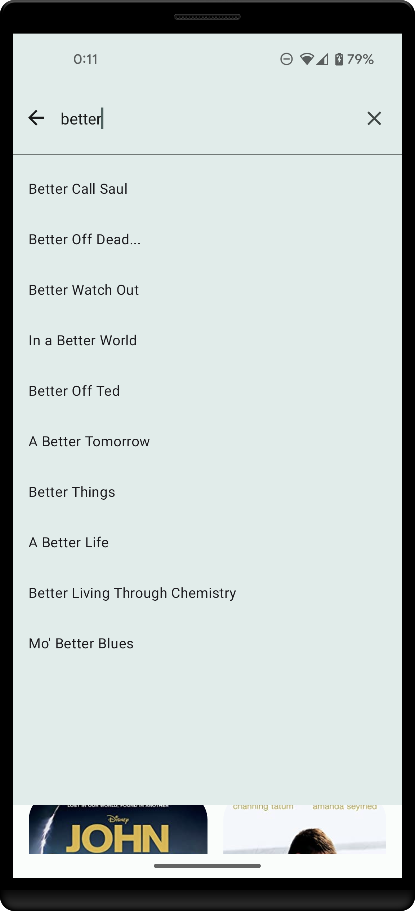
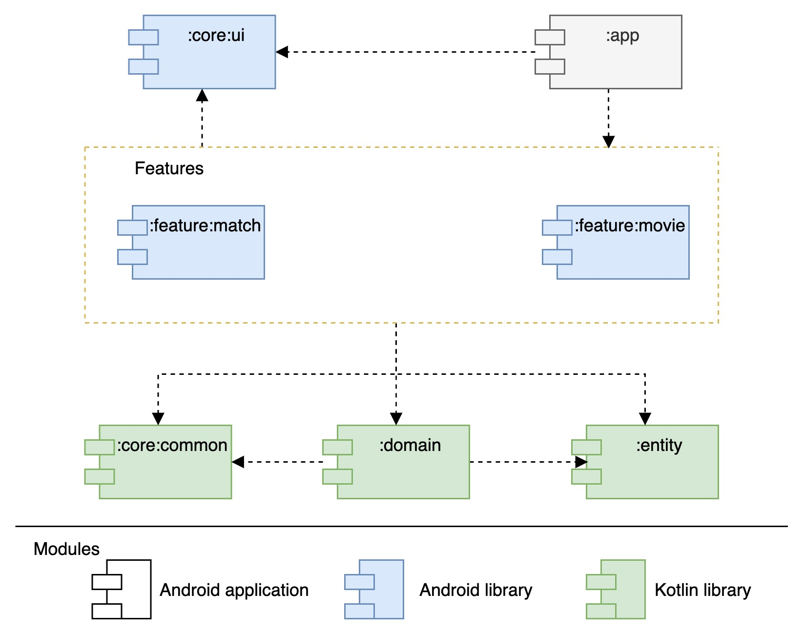

# Droid Arena: **Android App Architecture Demo**

This demo app implements Clean Architecture and incorporates modern tech stacks, with continuous updates for new tech stacks. The entire application is developed using Kotlin and follows Android's Material Design Guidelines.

**Match feature**

**Movie feature**

- [Feature](#features)
- [UI](#ui)
- [Architecture](#architecture)
    - [The Motivation](#the-motivation)
    - [Module](#modules)
    - [Tech stacks](#tech-stacks)
- [Upcoming features](#upcoming-features)

## **Features**

### Movie Search feature

This app is designed to provide an easy and efficient way to search for movies. It is a movie search app that connects to the OMDB API, which is a reliable source of information for movies. The app offers two main features that cater to different user needs.

The first feature is the ability to search for movies by title. The second feature of the app is to show the details of a movie. Users can access information such as the movie' genre, ratings, and more.

### Match Reminder feature

This is a sports match scheduler and reminder app designed to help users keep track of their favorite teams and matches of a hypothetical sports event. This app allows users to view participating teams, filter matches per team, set reminders for upcoming matches, and watch previous match highlights.

- The app's main screen displays both upcoming and previous matches. The Upcoming Matches section is located at the top and uses a RecyclerView in a horizontal layout. Tapping on an item allows the user to set a reminder for the match before it starts, with a reminder notification sent 5 minutes prior. Or cancel the reminder.
- The Previous Matches section appears below, showing matches in a vertical layout. The winner of each match is indicated by a check mark. To enhance user experience, all adapters for RecyclerViews use DiffUtils for smooth and efficient item change animations.
- An ExtendedFab is available, enabling users to filter matches by team or view all matches of an event in a separate screen with a search function.
- In the match detail screen, users can play highlight videos in portrait or full-screen mode. On Android 8+ devices, picture-in-picture mode is also available for enhanced viewing flexibility.

> Each feature will have a menu item that allows you to easily switch between them.
**Release**

[Latest version](https://github.com/toanpv/InspiusArena/releases/latest)

[Download APK](https://github.com/toanpv/InspiusArena/releases/latest/download/AppArchitectureSample_0.8.2_3_release.apk)

### UI

I have designed UI screens for all parts of the app, but I recognize that there is room for improvement. I plan to continue refining the design in future updates. All icons used in the app are from the Material Icon library and are licensed under the [Apache 2.0 license](https://www.apache.org/licenses/LICENSE-2.0.txt). The app icon was generated using Midjourney.

The app provides a personalized experience by adapting to the user's preference with support for both dark and light mode. The theme is automatically set based on the current system setting, providing a seamless transition between the two modes. Moreover, for devices running Android 12 or later, the app also uses DynamicColors to adjust the theme based on the system's accent color. I used a Figma plugin [Material Theme Builder](https://www.figma.com/community/file/1035203688168086460), to create the app's themes.

## Architecture

### The Motivation

The main idea behind selecting the architecture for the application is 'independence'. The software development industry is constantly updating with new tech stacks at a faster pace. We cannot afford to rewrite the application every 2 years, hence, 'independence' is chosen to minimize costs when there are changes in technology, even platforms. This is why the application is built with an architecture based on Clean Architecture from [Uncle Bob](https://blog.cleancoder.com/uncle-bob/2012/08/13/the-clean-architecture.html).

This is my implementation based on my understanding of Clean Architecture, which provides a well-defined separation of concerns and enables us to build applications that are easy to test, maintain and scale.

The UI layer is implemented using the MVVM design pattern.

### Modules

Project use gradle kts manage dependencies version by **`buidSrc`**  
|Module|Description|
|--|--|
|**`:entity`**| a Kotlin library module containing all of the entities of the system. Entities are the objects that represent the fundamental components of the application domain. This module provides a centralized location for defining these objects and ensures that they can be easily accessed by other modules.|
|**`:domain`**| a Kotlin library module containing the use cases of the system. Use cases are the operations that can be performed within the application domain. This module encapsulates all of the business logic of the system, ensuring that it remains independent of the UI layer, database, os and any external dependencies.|
|**`:core:common`**|a Kotlin library module containing common utility functions, helper classes, and other custom items that can be shared across multiple modules. They can be easily accessed by other modules.|
|**`:core:ui`**|an Android library module containing Android UI-related items such as themes, styles, values, custom widgets, and helper classes.|
|**`:app:`**|the application module that collects all of the features and modules and builds a complete application. This module defines the overall structure and behavior of the app, including the navigation between features, the layout of the UI, and the integration of external dependencies. It depends on all of the other modules to provide the necessary functionality.|
|**`:feature:movies`**|an Android library module that provides the movies feature for the app. This module contains the complete UI elements and flow of the movies feature, including screens, navigation, and interactions. It depends on the :domain and :core:ui modules to provide the necessary functionality.|
|**`:feature:match`**|an Android library module that provides the match feature for the app. This module contains the complete UI elements and flow of the match feature, including screens, navigation, and interactions. It depends on the :domain and :core:ui modules to provide the necessary functionality.|

### Tech stacks

To adhere to the principle of "independence", even with the operating system, all components used throughout the application are carefully considered to prioritize cross-platform support (without depending on the Android framework) and minimize the dependence on Android APIs. This is to aim for the development of cross-platform applications in the near future (I really hope that)

The main libraries used in the project are:

- DI with `Koin` for dependency injection
- `Kotlin coroutines` for concurrency
- `MongoDB Realm Kotlin SDK` for storage
- `Coil` for image loading
- `Ktor` for networking: Type-safe requests for convenient and safe API calls - it’s really awesome! :100:

**Movie module**
The module is written in the MVVM pattern, using the following modules: `:domain`, `:core:common`, and `:core:ui`

AndroidX libraries are used throughout the module

- `Navigation`: for navigating between fragments and following the single-activity pattern
- `ViewModel`, `LiveData`: for implementing the MVVM architecture, with an attempt to use Kotlin coroutines' Flow
- [Transition Framework](https://developer.android.com/training/transitions): shared element transitions determine how corresponding views move between two fragments during a fragment transition

Others implementation:
- The Material Design Components (MDC) library is used for all UI elements and theming (support dark and light mode). Including the use of `SearchView` in conjunction with a `SearchBar`.
- Custom animation instead of use CollapsingToolbarLayout for the movie's title in the detail screen  

**Match module**

The Match module is a complete module that includes all business logic related to the Match feature, including its own screens and flow. It can be easily integrated into any application module.

The module is designed with an **"Offline-first"** approach: data is synchronized (cleaned and updated) every time the app starts, and subsequent app features will use local data.

The module is written in the MVVM pattern, using the following modules: `:domain`, `:core:common`, and `:core:ui`

AndroidX libraries are used throughout the module:

- `App Startup`, `Splash Screen`, `WorkManager`: for data synchronization on app start-up with default splash screen
- `Navigation`: for navigating between fragments and following the single-activity pattern
- `ViewModel`, `LiveData`: for implementing the MVVM architecture, with an attempt to use Kotlin coroutines' Flow
- `DataSource`: for storing app configuration data and preferences

The Material Design Components (MDC) library is used for all UI elements and theming (support dark and light mode). Including the use of `SearchView` in conjunction with a `SearchBar`.

Play highlight video with [DKVideoPlayer](https://github.com/Doikki/DKVideoPlayer) and Picture-in-Picture

## **Upcoming features:**

As this project is still a work in progress, there are many more features that will be added and improved in the upcoming days. These features include:

**Movies module**

- [ ]  Detail screen: add more information
- [ ]  The bookmark feature and a screen to list of bookmark
- [ ]  A main screen will show top, popular movies

**Match module**

- [ ]  A list of reminder matches with the ability to toggle reminders directly from the list
- [ ]  UI improvements that will focus on the user's preferred team
- [ ]  The ability to choose themes, including a dark/night mode option
- [ ]  Layout transitions for the match detail screen

**Tech**:

- [ ]  Increased usage of Coroutines Flow
- [ ]  Integration of Android Jetpack Compose
- [ ]  Additional testing, including Instrumentation Tests
- [ ]  Implementation of Motion Layouts for more engaging UI transitions
- [ ]  CI/CD integration (Gitlab CI, fastlane…)
- [ ]  Checking: ktlint, sonarQube

**Prerequisites**

- Android Studio (Electric Eel)
- Android SDK
- A compatible Android device or emulator for testing

**Setup**

1. Clone the repository: git clone `https://github.com/toanpv/InspiusArena.git`
2. Open the project in Android Studio.
3. Sync Gradle dependencies and build the project.
4. Connect your Android device or start the emulator.
5. Run the app on the device or emulator by clicking the 'Run' button in Android Studio.

**Build**

    ./gradlew :app:assembleRelease

#### Small note for Reviewer:

> It has been over a year since I developed an end-user application. During this time, I have been focusing on learning about payment systems. I see this sample project as an opportunity to consolidate my experience in Android app development :innocent:. It took some time to bring this app to its current state (although I still need to complete the unit tests). I spent time researching and choosing the appropriate tech stack, layout for the screens, architecture, and transitioning to new tools such as ktor, coil, and Flow. Overall, this has been a great learning experience, and I am grateful for the opportunity. Thank you.
